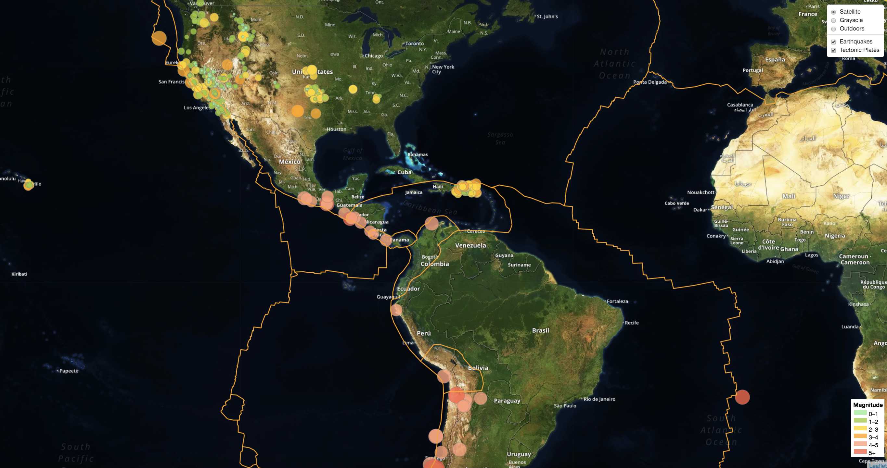

# Visualizing Earthquake Data with Leaflet

Welcome to the United States Geological Survey, or USGS for short! The USGS is responsible for providing scientific data about natural hazards, the health of our ecosystems and environment; and the impacts of climate and land-use change. 

I've created a map using Leaflet that plots all of the earthquakes in the last 7 days from the United States Geological Survey GeoJSON Feed page. Examined and illustrated the relationship between tectonic plates and seismic activity.

Below are the Programming languages used for this project:
- Bootstrap
- JavaScript
- Leaflet
- HTML
- CSS
- D3
- GeoJSON

